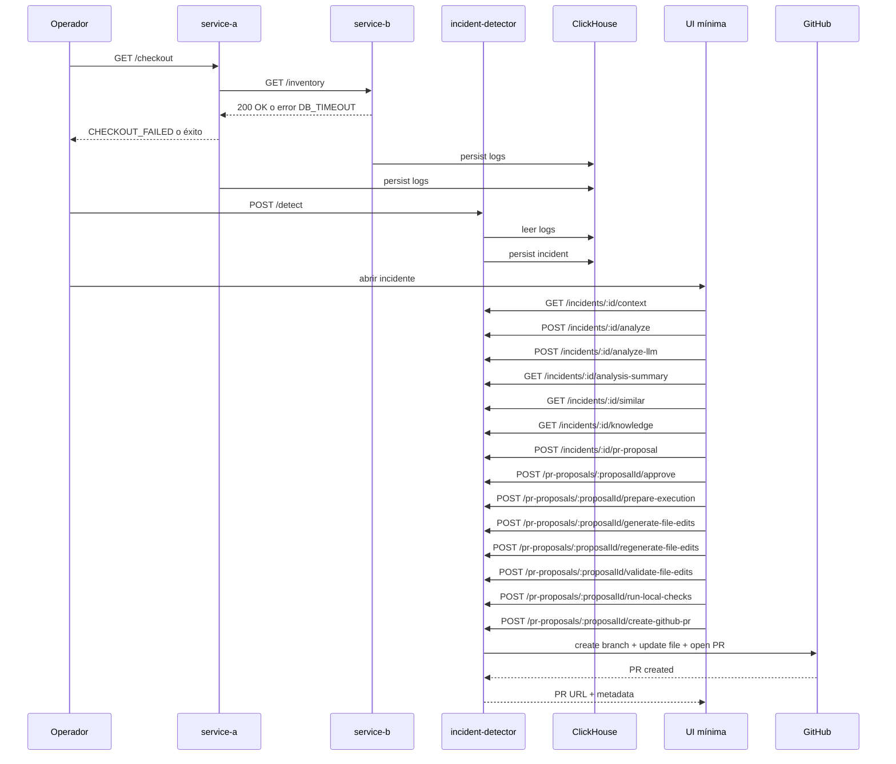

# OPERATIONAL_PLAYBOOK.md

# AI Debugger — Operational Playbook

> Manual operativo para ejecutar, validar y depurar el pipeline completo de **AI Debugger** en local, desde generación de incidente hasta creación de Pull Request real en GitHub.
>
> Este playbook está basado en el flujo validado en este proyecto y documenta el recorrido operativo real, los checkpoints por etapa y los problemas encontrados durante la implementación. Fue generado a partir del contexto confirmado en la conversación del proyecto. fileciteturn18file0

---

## Tabla de contenidos

- [1. Objetivo](#1-objetivo)
- [2. Alcance del playbook](#2-alcance-del-playbook)
- [3. Prerrequisitos](#3-prerrequisitos)
- [4. Servicios y componentes que deben estar disponibles](#4-servicios-y-componentes-que-deben-estar-disponibles)
- [5. Variables y configuración relevantes](#5-variables-y-configuración-relevantes)
- [6. Flujo operacional end-to-end](#6-flujo-operacional-end-to-end)
- [7. Checkpoints de validación por etapa](#7-checkpoints-de-validación-por-etapa)
- [8. Happy path completo](#8-happy-path-completo)
- [9. Troubleshooting por etapa](#9-troubleshooting-por-etapa)
- [10. Señales de éxito del pipeline](#10-señales-de-éxito-del-pipeline)
- [11. Comandos y requests de referencia](#11-comandos-y-requests-de-referencia)
- [12. Notas operativas importantes](#12-notas-operativas-importantes)

---

## 1. Objetivo

Este playbook existe para poder:

- levantar el sistema en local sin perder el orden correcto,
- generar un incidente reproducible,
- recorrer el pipeline completo del AI Debugger,
- validar cada etapa con evidencia concreta,
- y llegar hasta un Pull Request real en GitHub.

---

## 2. Alcance del playbook

Este documento cubre el flujo validado para:

- ingestión y persistencia de logs,
- detección de incidentes,
- construcción de contexto,
- RCA heurístico,
- RCA con LLM,
- summary,
- similar incidents,
- knowledge retrieval,
- cause ranking determinista,
- cause ranking LLM,
- feedback humano,
- PR proposal,
- aprobación/rechazo humano,
- prepare-execution,
- generate-file-edits,
- regenerate-file-edits,
- validate-file-edits,
- run-local-checks,
- create-github-pr.

> No cubre merge automático del PR. Eso queda fuera del flujo validado actual.

---

## 3. Prerrequisitos

### Software base

- Node.js + npm
- Docker Desktop o Docker Engine operativo
- Git
- Acceso a ClickHouse local vía contenedor
- Acceso a GitHub con token válido para el repositorio objetivo
- Sistema operativo validado en esta implementación: Windows con Git Bash / PowerShell

### Capacidades necesarias

- poder correr servicios Node/TypeScript por separado,
- poder ejecutar requests HTTP (curl, Postman o navegador),
- poder reiniciar servicios después de cambios de `.env` o código.

---

## 4. Servicios y componentes que deben estar disponibles

### Backend y servicios

- `service-a`
- `service-b`
- `incident-detector`
- `log-ingestor` *(pendiente de validación exacta de cómo lo arrancas en tu entorno actual)*
- ClickHouse
- OpenTelemetry Collector *(si el flujo de observabilidad lo requiere en tu setup local)*

### UI mínima

- frontend en `http://localhost:3000`

### Puertos confirmados en el flujo

- frontend: `http://localhost:3000`
- `service-a`: `http://localhost:3001`
- `service-b`: `http://localhost:3002`
- backend / incident-detector: `http://localhost:3020`

---

## 5. Variables y configuración relevantes

### service-b

Scripts confirmados en `services/service-b/package.json` durante la validación del pipeline:

- `dev`
- `build`
- `typecheck` *(agregado durante la puesta a punto del flujo local; validar que permanezca)*
- `test` no configurado en el estado validado actual

### GitHub

Variables relevantes para `create-github-pr`:

```env
GITHUB_TOKEN=...
GITHUB_API_BASE_URL=https://api.github.com
GITHUB_COMMITTER_NAME=AI Debugger Bot
GITHUB_COMMITTER_EMAIL=bot@ai-debugger.local
```

### PR proposal

Variables relevantes usadas por el pipeline o sus defaults:

```env
PR_PROPOSAL_DEFAULT_REPOSITORY=AwZatarra/ai-debugger
PR_PROPOSAL_DEFAULT_TARGET_BRANCH=master
```

> Verifica que `PR_PROPOSAL_DEFAULT_REPOSITORY` y el branch base coincidan con el repo real antes de crear proposals nuevas.

---

## 6. Flujo operacional end-to-end



---

## 7. Checkpoints de validación por etapa

| Etapa | Acción | Checkpoint de éxito | Evidencia esperada |
|---|---|---|---|
| 1 | Levantar `service-b` | servicio vivo | `GET /health` responde `{ "ok": true, "service": "service-b" }` |
| 2 | Generar incidente | checkout falla o se propaga timeout | `service-a /checkout` devuelve `CHECKOUT_FAILED` con detalle de inventory |
| 3 | Detectar incidente | incidente persistido | `POST /detect` crea incidente y aparece en UI |
| 4 | Abrir contexto | contexto renderiza | `GET /incidents/:id/context` devuelve summary + evidence + logs |
| 5 | RCA heurístico | análisis generado | `POST /incidents/:id/analyze` devuelve root cause y confidence |
| 6 | RCA LLM | análisis LLM generado | `POST /incidents/:id/analyze-llm` devuelve root cause, fix y patch |
| 7 | Similar/knowledge | enriquecimiento presente | `GET /similar` y `GET /knowledge` devuelven resultados |
| 8 | Cause ranking | ranking disponible | endpoints de ranking responden y se puede guardar feedback |
| 9 | PR proposal | proposal creada | status `pending_review` |
| 10 | Review humana | propuesta aprobada o rechazada | status cambia a `approved` o `rejected` |
| 11 | Prepare execution | plan ejecutable | status `prepared`, archivos concretos, branch sugerido |
| 12 | Generate/regenerate edits | edits concretos | `file_edits` presentes, sin paths inválidos |
| 13 | Validate edits | edits válidos | `valid: true` y source action correcto |
| 14 | Run local checks | build real ejecutado | `has_real_checks: true`, `npm run build` con `ok: true` |
| 15 | Create GitHub PR | PR abierto | `pr_created`, URL del PR y commit generado |

---

## 8. Happy path completo

### 8.1 Levantar servicios

#### service-b

```bash
cd services/service-b
npm run dev
```

Validar:

```bash
curl http://localhost:3002/health
```

Esperado:

```json
{"ok":true,"service":"service-b"}
```

#### incident-detector

Arráncalo en tu forma habitual.

> Pendiente de validación: comando exacto de arranque del `incident-detector` en este entorno.

#### UI mínima

Arráncala y abre:

```text
http://localhost:3000
```

---

### 8.2 Generar el incidente de ejemplo

Lanza varias veces:

```bash
curl http://localhost:3001/checkout
```

Comportamiento esperado cuando el timeout ocurre:

```json
{
  "ok": false,
  "error": "CHECKOUT_FAILED",
  "detail": {
    "ok": false,
    "error": "DB_TIMEOUT"
  }
}
```

> Esto es coherente con el `service-b` validado actual, que responde `500 + DB_TIMEOUT` cuando detecta timeout en `/inventory`.

---

### 8.3 Detectar incidente

```http
POST http://localhost:3020/detect
```

Validar:
- se crea al menos un incidente,
- aparece en la UI mínima.

---

### 8.4 Abrir detalle del incidente

En la UI mínima:
- entrar a la lista de incidentes,
- abrir el incidente nuevo.

Validar que se cargue:
- contexto,
- evidencia,
- trace logs,
- correlated errors.

---

### 8.5 Ejecutar RCA heurístico

Desde UI o API:

```http
POST /incidents/:id/analyze
```

Validar:
- root cause presente,
- confidence,
- suggested fix,
- suggested patch.

---

### 8.6 Ejecutar RCA con LLM

```http
POST /incidents/:id/analyze-llm
```

Validar:
- explicación completa,
- suggested fix,
- suggested patch.

---

### 8.7 Validar summary, similares y knowledge

```http
GET /incidents/:id/analysis-summary
GET /incidents/:id/similar
GET /incidents/:id/knowledge
```

Validar:
- summary final disponible,
- incidentes similares,
- knowledge matches.

---

### 8.8 Cause ranking + feedback

Usar los endpoints de ranking y feedback ya implementados.

Validar:
- ranking persistido,
- feedback persistido,
- evaluation por incidente visible,
- stats globales disponibles.

---

### 8.9 Crear PR proposal

```http
POST /incidents/:id/pr-proposal
```

Body ejemplo:

```json
{
  "repository": "AwZatarra/ai-debugger",
  "target_branch": "master",
  "allowlisted_paths": [
    "services/service-b/src/",
    "incident-detector/src/"
  ]
}
```

Validar:
- proposal creada,
- `status = pending_review`,
- `repository` correcto,
- `target_branch` correcto.

---

### 8.10 Review humana

#### Aprobar

```http
POST /pr-proposals/:proposalId/approve
```

Body ejemplo:

```json
{
  "reviewer": "pool",
  "notes": "Aprobada para continuar con automatización posterior."
}
```

Validar:
- proposal pasa a `approved`,
- `reviewed_at`, `reviewer`, `review_notes` presentes.

---

### 8.11 Prepare execution

```http
POST /pr-proposals/:proposalId/prepare-execution
```

Validar:
- `ready: true`
- acción `prepared`
- `suggested_branch_name`
- archivos concretos en el execution plan

---

### 8.12 Generate file edits

```http
POST /pr-proposals/:proposalId/generate-file-edits
```

Si el resultado introduce paths inválidos o archivos inexistentes, usar regeneración.

---

### 8.13 Regenerate file edits

```http
POST /pr-proposals/:proposalId/regenerate-file-edits
```

Validación esperada en el flujo ya probado:
- edits reducidos a un archivo runtime real:
  - `services/service-b/src/index.ts`

---

### 8.14 Validate file edits

```http
POST /pr-proposals/:proposalId/validate-file-edits
```

Validar:
- `valid: true`
- `source_action_status: "edits_regenerated"` o el source correcto
- sin paths inexistentes

---

### 8.15 Run local checks

```http
POST /pr-proposals/:proposalId/run-local-checks
```

Validar:
- `has_real_checks: true`
- `executed_checks_count: 1`
- `npm run build` con `ok: true`
- `status = local_checks_passed`

> El flujo validado terminó usando un workspace temporal dentro de `repoRoot/.tmp/...` y reutilizando `services/service-b/node_modules` mediante junction para que el build del workspace pudiera resolver dependencias correctamente.

---

### 8.16 Create GitHub PR

```http
POST /pr-proposals/:proposalId/create-github-pr
```

Validar:
- `status = pr_created`
- PR URL presente
- commit creado
- branch base correcto
- branch head correcto

Resultado validado en este proyecto:
- PR abierto correctamente sobre `AwZatarra/ai-debugger`
- base branch: `master`
- archivo actualizado: `services/service-b/src/index.ts`

---

## 9. Troubleshooting por etapa

### 9.1 `service-b` parece “morirse” al hacer `npm run dev`
**Síntoma**
- el prompt vuelve y parece que el servicio murió.

**Validación**
- probar `GET /health`
- revisar `netstat -ano | findstr :3002`

**Causa probable**
- falsa alarma de terminal / Git Bash

**Señal correcta**
- si `/health` responde y el puerto 3002 está `LISTENING`, el servicio sigue vivo.

---

### 9.2 `prepare-execution` falla por paths como carpeta
**Síntoma**
- `ready: false`
- paths tipo `services/service-b/src/`

**Causa**
- proposal generada con directorios en vez de archivos concretos

**Solución**
- endurecer `prProposalGenerator.ts`
- exigir `changed_files.path` como archivo concreto

---

### 9.3 `validate-file-edits` usa la acción vieja
**Síntoma**
- sigue validando un edit viejo aunque ya hubo regeneración

**Causa**
- el validator leía siempre `edits_generated`

**Solución**
- priorizar `edits_regenerated`
- y usar `edits_generated` solo como fallback

---

### 9.4 `run-local-checks` en Windows falla con `spawn EINVAL`
**Síntoma**
- comandos `npm.cmd` fallan con `spawn EINVAL`

**Causa**
- invocación incorrecta del runner en Windows

**Solución**
- usar `exec(...)` con shell explícita:
  - `cmd.exe /c npm run build`

---

### 9.5 `run-local-checks` pasa aunque no corrió nada
**Síntoma**
- `local_checks_passed` pero todos los checks están skipped

**Causa**
- lógica demasiado optimista

**Solución**
- exigir:
  - `has_real_checks = true`
  - `executed_checks_count > 0`
- si todo se salta, marcarlo como `local_checks_inconclusive`

---

### 9.6 `service-b` no tiene scripts `build` o `test`
**Síntoma**
- `npm error Missing script: "build"` o `"test"`

**Solución**
- agregar scripts mínimos reales, por ejemplo:
  - `typecheck`
  - `build`

---

### 9.7 Error TS6059 por `rootDir`
**Síntoma**
- TypeScript indica que archivos `shared/...` no están bajo `rootDir`

**Causa**
- `rootDir` apuntaba a `./src`, pero `include` también traía `../../shared/**/*.ts`

**Solución validada**
- ampliar `rootDir` para cubrir lo incluido

Ejemplo validado:

```json
{
  "compilerOptions": {
    "rootDir": "../..",
    "outDir": "./dist",
    "module": "nodenext",
    "target": "es2020",
    "moduleResolution": "nodenext",
    "esModuleInterop": true,
    "strict": true,
    "skipLibCheck": true
  },
  "include": [
    "src/**/*.ts",
    "../../shared/**/*.ts"
  ]
}
```

---

### 9.8 Error por `moduleResolution=node` deprecado
**Síntoma**
- TS5107 por `moduleResolution=node`

**Solución**
- migrar a:
  - `"module": "nodenext"`
  - `"moduleResolution": "nodenext"`

---

### 9.9 `run-local-checks` falla por rutas recursivas y `ENAMETOOLONG`
**Síntoma**
- rutas larguísimas dentro de `.tmp/.../.tmp/...`

**Causa**
- el workspace temporal se copiaba a sí mismo porque la carpeta `.tmp` no estaba excluida

**Solución**
- excluir `.tmp` en `copyDirectoryRecursive(...)`
- usar nombres de workspace más cortos

---

### 9.10 `run-local-checks` falla por módulos no encontrados en workspace
**Síntoma**
- `Cannot find module 'axios'`
- build falla en el workspace temporal

**Causa**
- el workspace no resolvía dependencias del servicio real

**Solución validada**
- crear un junction/symlink de:
  - `workspace/services/service-b/node_modules`
  - apuntando a `repo/services/service-b/node_modules`

---

### 9.11 `create-github-pr` falla con `401 Bad credentials`
**Síntoma**
- GitHub API responde `401`

**Causa**
- token inválido, vencido o no recargado en backend

**Solución**
- verificar `GITHUB_TOKEN`
- reiniciar backend
- validar permisos

---

### 9.12 `create-github-pr` falla con `404` en `refs/heads/main`
**Síntoma**
- branch base `main` no encontrado

**Causa**
- el repo real usa otro branch base, por ejemplo `master`

**Solución**
- crear la proposal con `target_branch` correcto
- o detectar `default_branch` automáticamente

---

## 10. Señales de éxito del pipeline

El pipeline se considera exitoso cuando tienes evidencia de:

- proposal `approved`
- action `prepared`
- action `edits_validated`
- action `local_checks_passed`
- action `pr_created`
- URL del PR abierta en GitHub

---

## 11. Comandos y requests de referencia

### Health check

```bash
curl http://localhost:3002/health
```

### Generar incidente

```bash
curl http://localhost:3001/checkout
```

### Detectar incidente

```http
POST http://localhost:3020/detect
```

### Create PR proposal

```http
POST http://localhost:3020/incidents/:id/pr-proposal
```

### Approve

```http
POST http://localhost:3020/pr-proposals/:proposalId/approve
```

### Prepare execution

```http
POST http://localhost:3020/pr-proposals/:proposalId/prepare-execution
```

### Generate / regenerate edits

```http
POST http://localhost:3020/pr-proposals/:proposalId/generate-file-edits
POST http://localhost:3020/pr-proposals/:proposalId/regenerate-file-edits
```

### Validate

```http
POST http://localhost:3020/pr-proposals/:proposalId/validate-file-edits
```

### Local checks

```http
POST http://localhost:3020/pr-proposals/:proposalId/run-local-checks
```

### Create GitHub PR

```http
POST http://localhost:3020/pr-proposals/:proposalId/create-github-pr
```

---

## 12. Notas operativas importantes

- No asumas que el branch base es `main`; valida el `default_branch` real del repo.
- No consideres un `local_checks_passed` como válido si todo quedó skipped.
- Si el servicio no tiene test runner real, no fuerces generación de tests en el pipeline.
- El patch validado que llegó a PR real quedó reducido a un solo archivo runtime:
  - `services/service-b/src/index.ts`
- El comportamiento validado actual de `service-b /inventory` sigue devolviendo:
  - `500`
  - `DB_TIMEOUT`
  cuando detecta timeout, lo cual es coherente con la implementación final revisada en local.
- El pipeline actual ya demostró crear un PR real en GitHub con guardrails y validación previa.

---

> Recomendación final: usa este playbook como guía operativa viva. Cada vez que agregues una etapa nueva al pipeline, añade aquí su checkpoint, su endpoint y su troubleshooting asociado.
